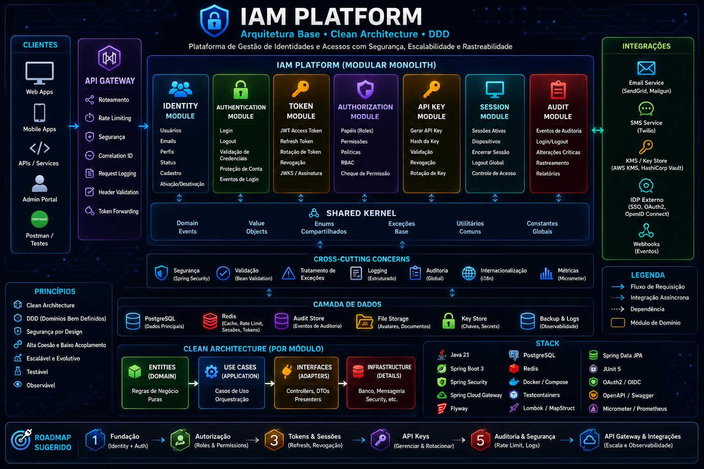

# IAM Platform



## Project Goal

IAM Platform is a Java Spring Boot platform for identity and access management. The goal is to provide a clear foundation for authentication, authorization, user lifecycle, access policies, and security-related capabilities while keeping the system modular, understandable, and ready to evolve.

The project currently focuses on the Identity module, including the core domain model, user registration use case, persistence adapter, REST API, validation, exception handling, tests, and endpoint documentation.

## Architecture Overview

The platform is organized as a Maven multi-module project with a single deployable direction and clearly separated responsibilities. The architecture favors explicit module boundaries, shared language, and isolated application concerns so the codebase can grow without becoming tightly coupled.

The initial structure separates edge concerns, IAM application concerns, and shared cross-module foundations. Documentation and infrastructure folders are included from the beginning to keep architecture decisions, diagrams, and deployment assets close to the codebase.

## Modular Monolith Approach

IAM Platform starts as a Modular Monolith. This keeps development and deployment simple while still enforcing boundaries between major parts of the system.

The intent is to gain the operational simplicity of a monolith without treating the codebase as one large undifferentiated application. Each module should own a clear responsibility, communicate through deliberate contracts, and avoid leaking internal details into other modules.

This approach allows the platform to evolve gradually. If a future need justifies extracting a module into a separate service, the codebase should already have the conceptual boundaries needed to make that move with less friction.

## Clean Architecture + DDD

The project follows Clean Architecture and Domain-Driven Design principles as architectural guidance.

Clean Architecture provides the direction for dependency flow: core business concepts should remain independent from frameworks, transport mechanisms, databases, and infrastructure details.

Domain-Driven Design provides the modeling discipline: the platform is organized around the IAM domain language, with clear boundaries, meaningful concepts, and modules that reflect business capabilities rather than technical layers alone.

The current implementation keeps the Identity domain and application layers protected from REST and persistence details. External concerns such as HTTP controllers, exception handling, and database adapters are implemented at the edges of the system.

## Test Coverage

This project uses JaCoCo to generate test coverage reports.

Run:

```bash
mvn clean verify
```

## 🚀 IAM Platform

Building an Identity and Access Management Platform using Java, Spring Boot, DDD and Clean Architecture.

Status:

✅ Project foundation
✅ Identity domain model
✅ Register user use case
✅ Domain exceptions
✅ Persistence adapter
✅ Identity REST API
✅ Register user endpoint documentation
🟡 Database migration
⚪ Authentication
⚪ Authorization
⚪ Sessions
⚪ API Keys
⚪ Audit
⚪ OAuth2 / OIDC


## Main Modules

- `iam-application`: main IAM application module and primary place for identity and access management capabilities.
- `api-gateway`: gateway module responsible for edge-facing concerns and platform entry points.
- `shared-kernel`: shared foundation for stable cross-module concepts that are intentionally reused.

## API Documentation

- [Identity user registration endpoint](docs/identity/register-user-endpoint.md)

## Project Layout

```text
iam-platform/ 
├── iam-application/ 
├── api-gateway/ 
├── shared-kernel/ 
├── docs/ 
│   ├── architecture/ 
│   ├── identity/ 
│   │ └── register-user-endpoint.md 
│   └── diagrams/ 
│       └── iam-platform-architecture-dark.png 
├── docker/ 
├── pom.xml 
└── README.md
```
