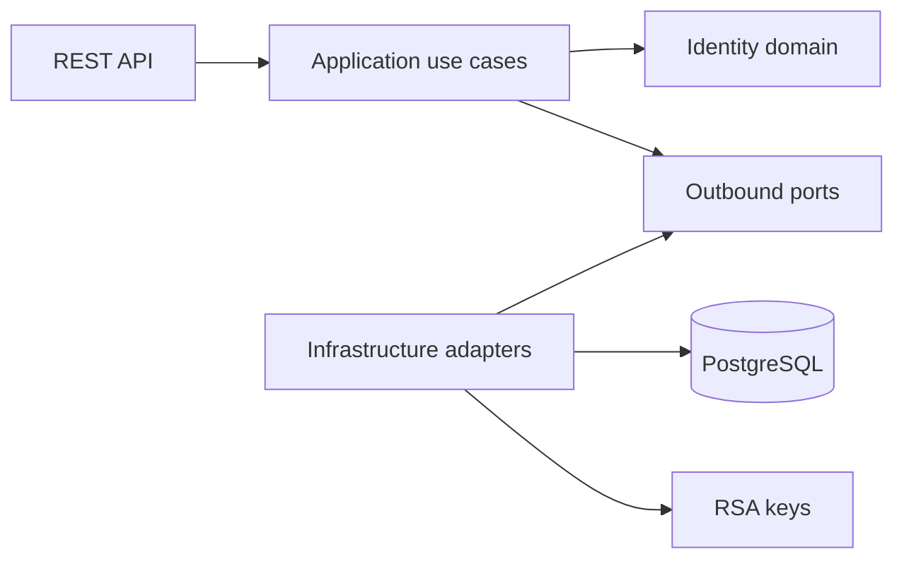
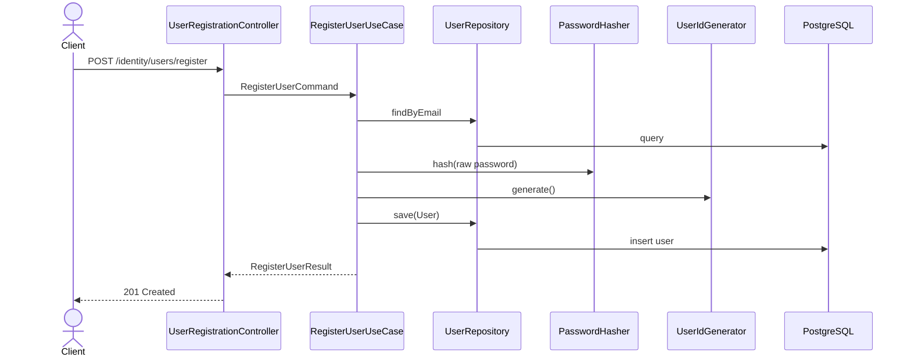
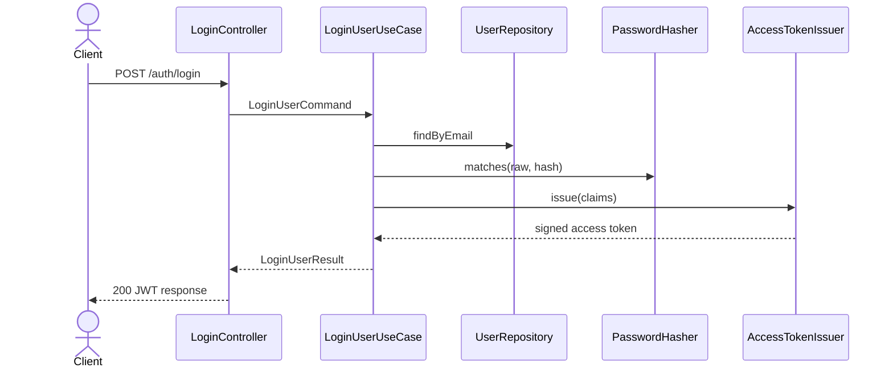
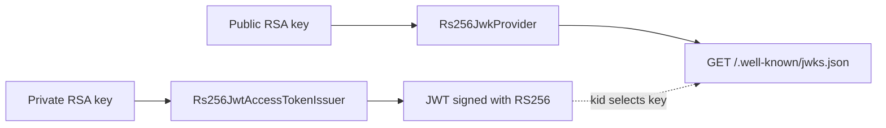
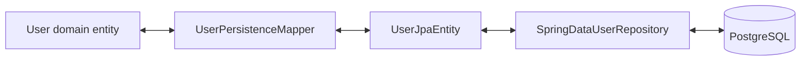
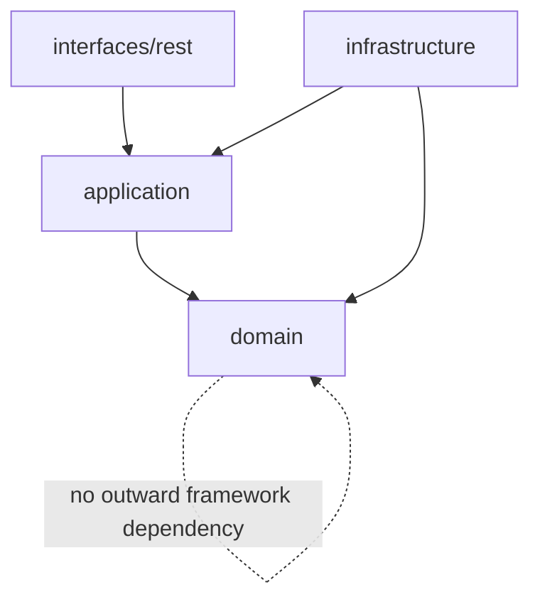
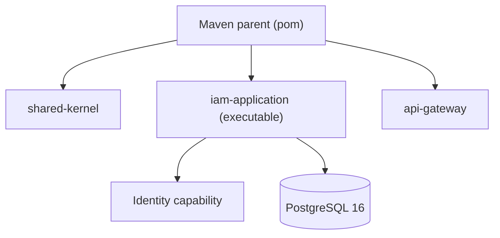

# Architecture and flow diagrams

The existing [architecture image](iam-platform-architecture-dark.png) is a conceptual target view and includes roadmap capabilities. It must not be read as a list of fully implemented features. The Mermaid diagrams below describe the current implementation.

## High-level architecture

## Registration flow

## Login flow

## JWT and JWKS flow

## Persistence mapping

## Package and layer dependencies

## Modular monolith deployment

