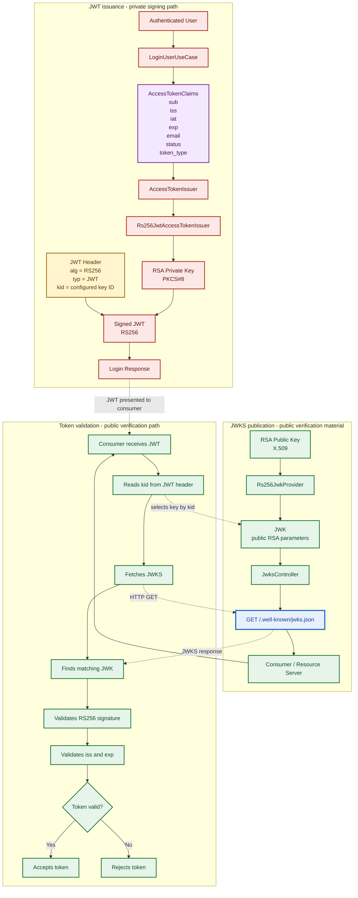

# JWT RS256 and JWKS Flow

The IAM Platform signs access tokens with an RSA private key. Consumers and resource servers validate those tokens with the corresponding RSA public key: the private key is never exposed, while the public key is published through the platform's JSON Web Key Set (JWKS) endpoint.

## Security notes

- The RSA private key signs access tokens and must remain confidential.
- The corresponding RSA public key validates token signatures without granting signing capability.
- JWKS must expose only public RSA parameters. Private RSA parameters must never appear in the response.
- The `kid` value links the JWT header to the correct JWK in the published key set.
- Refresh tokens and key rotation are not implemented yet.
